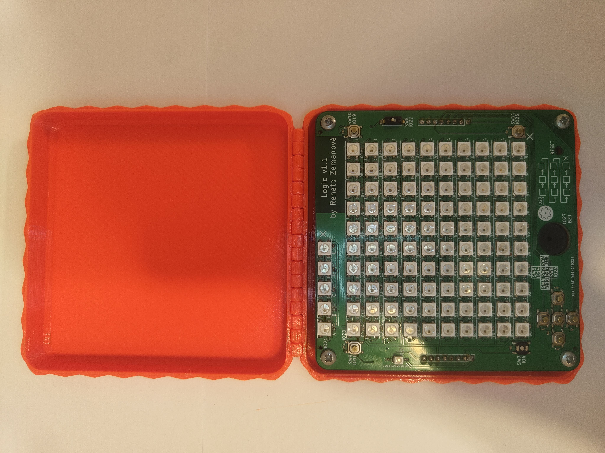
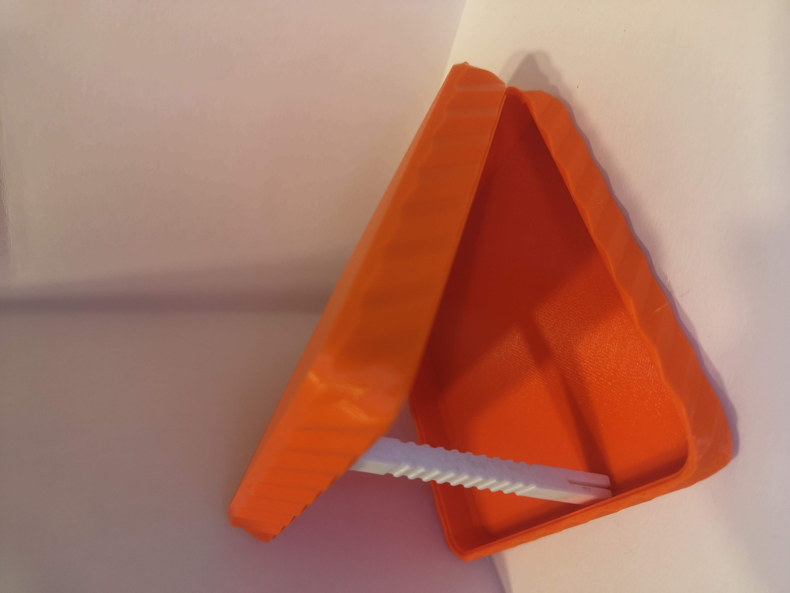
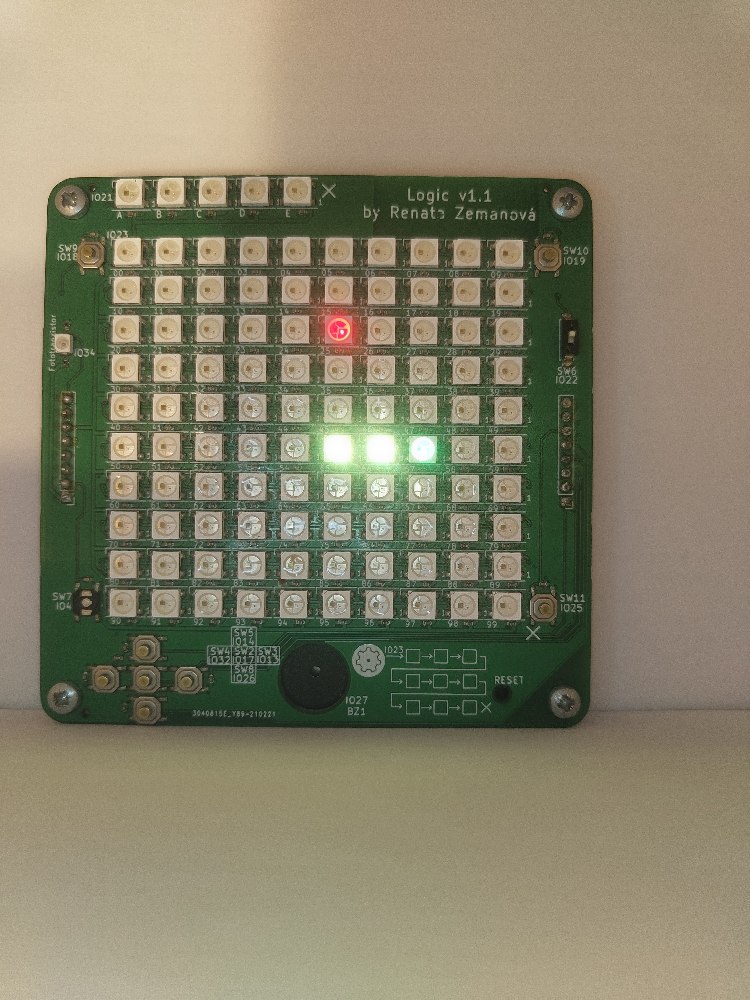
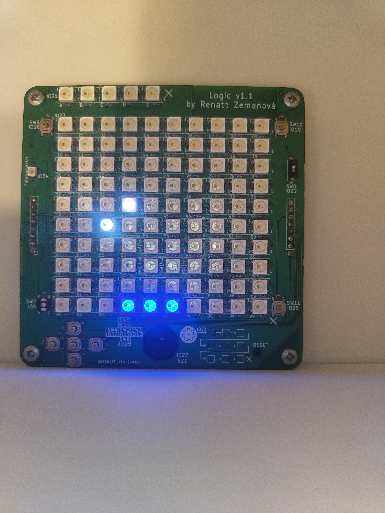
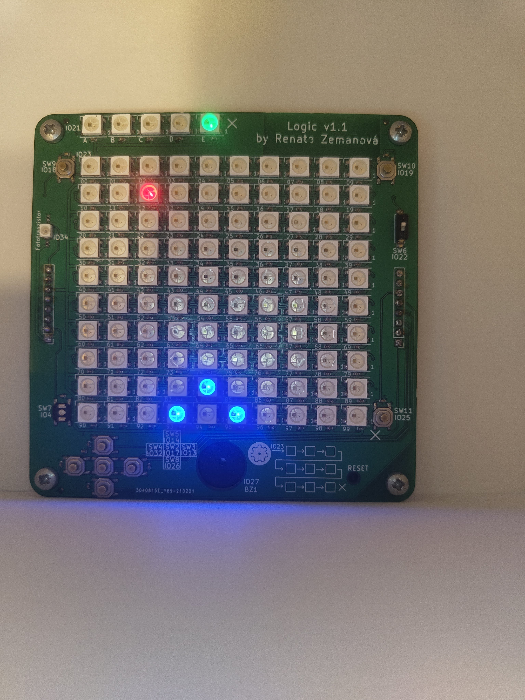
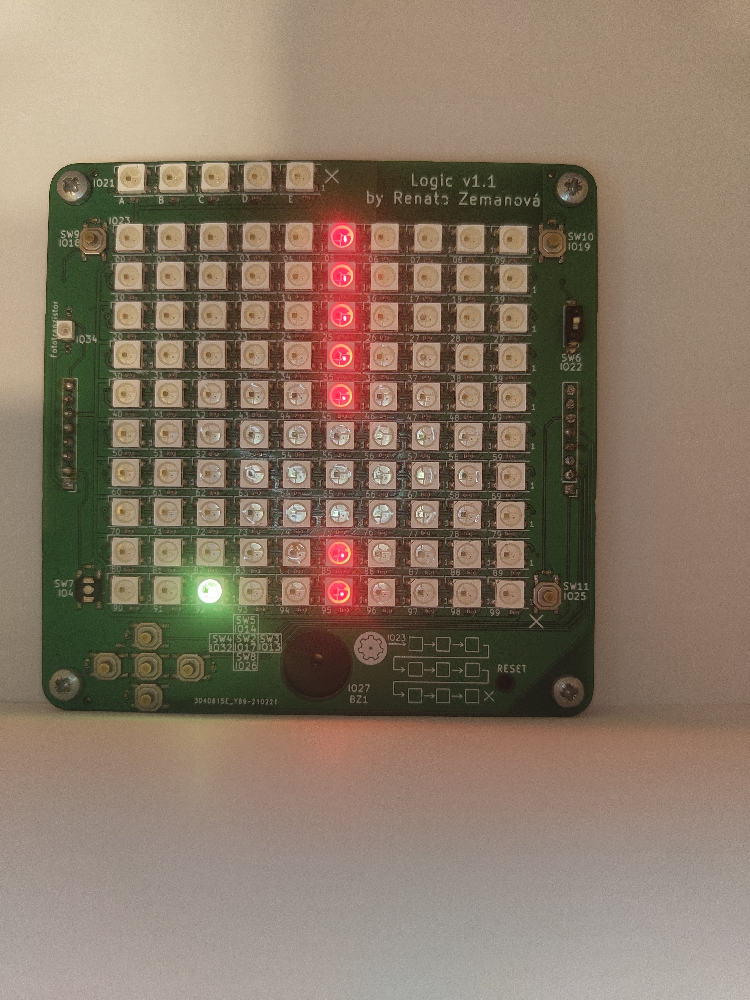
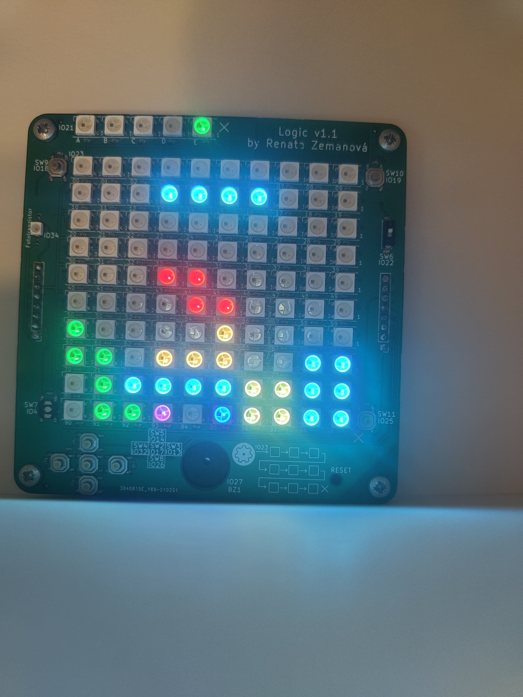
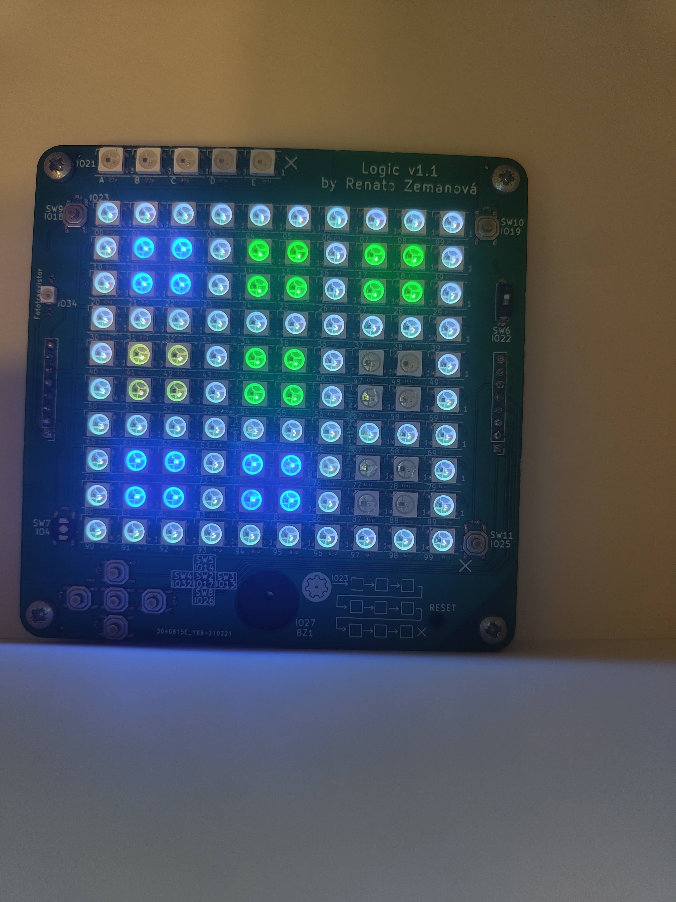
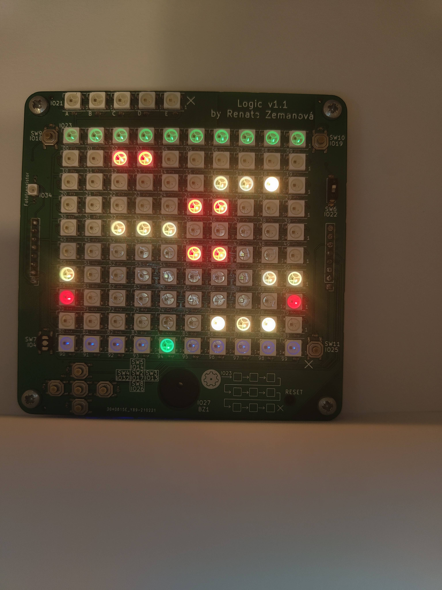
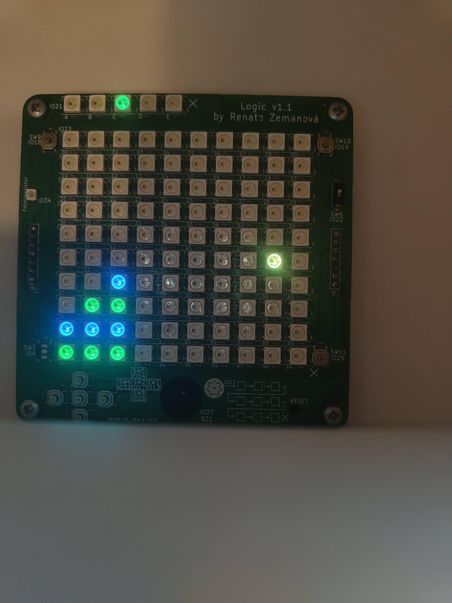

# Logic - Mini Games Console System

This repository contains a custom gaming system and a collection of retro games written in the Arduino environment (C++) for the ESP32 microcontroller on the Logic hardware board.

The project transforms a 10x10 LED matrix into a portable gaming console featuring an integrated menu system, sound effects, non-volatile high score storage, and asynchronous brightness control.

---

## Project Gallery

### Hardware and Case
The appearance of the assembled board and the enclosure designed for portable gaming.

| 00 - Inside the case | 09 - Case |
| :---: | :---: |
|  |  |

### Game Previews
Visual representation of the integrated mini games displayed on the LED matrix:

| 01 - Game 1 (Snake) | 02 - Game 2 (Pong) | 03 - Game 3 (Shooter) |
| :---: | :---: | :---: |
|  |  |  |

| 04 - Game 4 (Flappy Bird) | 05 - Game 5 (Tetris) | 06 - Game 6 (TicTacToe) |
| :---: | :---: | :---: |
|  |  |  |

| 07 - Game 7 (Frogger) | 08 - Game 8 (Stackers) |
| :---: | :---: |
|  |  |

---

## Software Features and Technical Implementation

* **Asynchronous Dual-Core Brightness Management:** Reading data from the photoresistor (`LIGHT_SENSOR_PIN`) and dynamically mapping the LED matrix brightness runs on Core 0 of the ESP32 (`brightnessTask`). This guarantees that ambient lighting adjustments never impact the frame rate of the main game loop running on Core 1.
* **Hardware-Accelerated Audio (LEDC):** Generating buzzer tones utilizes the hardware LEDC module on `BUZZER_CHANNEL`. This architecture avoids timing conflicts with the FastLED library (RMT peripheral) and provides 5 distinct volume levels, including a full Mute mode.
* **Persistent High Score Storage:** The highest achieved score for each game is saved into the non-volatile flash memory of the ESP32 using the `Preferences.h` library. Data remains intact even after a complete power cycle or hardware reset.
* **Binary Score Indication:** The current in-game score is displayed in real-time on a dedicated array of five status LEDs (`SCORE_LED_PIN`) using binary notation and bitwise operations. Holding down the score button for 2 seconds clears the stored record for the selected game.

---

## Integrated Game List

1. **Game 1: Snake** – Classic snake implementation featuring red pellet collection, incremental body lengthening, and self collision detection.
2. **Game 2: Pong** – Arcade paddle game with a bouncing ball that dynamically accelerates as the score increases, played against a walls.
3. **Game 3: Shooter** – Defense game where the player controls a ship on the bottom row of the matrix to shoot down falling targets that spawn at an increasing rate.
4. **Game 4: Flappy Bird** – Navigating through randomized gaps in approaching obstacles utilizing a gravity physics model with physics jumps triggered by directional inputs.
5. **Game 5: Tetris** – Complete implementation of Tetris featuring all 7 standard tetromino shapes, rotations, wall kicks, and automatic line clearing.
6. **Game 6: TicTacToe** – Local match against an autonomous AI algorithm on a 3x3 grid, including automatic cursor teleportation to available slots and intelligent move calculation.
7. **Game 7: Frogger** – Assisting a frog navigate from the bottom to the top of the matrix across 8 lanes of incoming traffic moving at varied speeds and directions.
8. **Game 8: Stackers** – Building a vertical tower out of moving blocks. Any block overlapping the edge is cut off, and successfully reaching the 10th row triggers a rainbow animation sequence.

---

## Controls and Hardware Pin Mapping

The console is controlled via a set of built-in push buttons configured with internal pull-up resistors:
* **Menu and In-Game Navigation:** Directional buttons UP (GPIO 14), DOWN (GPIO 26), LEFT (GPIO 32), and RIGHT (GPIO 13).
* **Confirm and Action:** The OK button (GPIO 17) is used to launch games from the menu and perform primary action tasks within games.
* **Exit:** The BACK button (GPIO 25) instantly terminates any running game loop and safely redirects the user to the main selection screen.
* **Audio Management:** The MUTE button (GPIO 19) cycles through volume levels (0 to 5) and displays the selected level on the score LEDs.
* **Record Review:** The SCORE button (GPIO 18) displays the current high score of the highlighted game in gold. Holding it down for 2 seconds clears the score.

---

## Original Project Acknowledgments

This software was developed specifically for the **Logic V1** hardware platform designed by the **RoboticsBrno** community.
* Original hardware repository: [RoboticsBrno/RB3205-Logic](https://github.com/RoboticsBrno/RB3205-Logic)
* Official board documentation: [logic.robotikabrno.cz](https://logic.robotikabrno.cz/)
